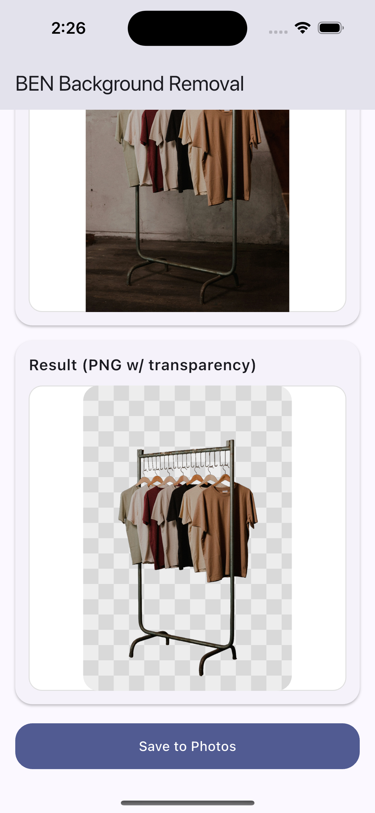

# BackgroundErase.NET (BEN2) – Flutter Demo + API Client

Pick a photo and remove the background using the BackgroundErase.NET API. Works on iOS, Android, web, and desktop.

- API base: https://api.backgrounderase.net/v2
- Get your API key: https://backgrounderase.net/account
- Buy/upgrade a plan: https://backgrounderase.net/pricing



## Quick start

1) Get an API key  
- Create an account or sign in: https://backgrounderase.net/account  
- If needed, purchase a plan: https://backgrounderase.net/pricing

2) Get the code  
Option A: Clone this repo’s Flutter folder
```bash
git clone --no-checkout https://github.com/PramaLLC/ben-api-other-integrations.git
cd ben-api-other-integrations
git sparse-checkout init --cone
git sparse-checkout set Flutter
git checkout main
cd Flutter
```

Option B: Copy into your app  
- Copy /lib/ben_client.dart and the other /lib files into your Flutter project
- Add the listed dependencies (see pubspec.yaml section below)

3) Install dependencies
```bash
flutter pub get
```

4) Add your API key  
- Open lib/main.dart  
- Replace the placeholder:
```dart
const String kBenApiKey = 'YOUR_API_KEY_HERE';
```

5) Run
```bash
# iOS (requires Xcode setup)
flutter run -d ios

# Android (requires Android SDK)
flutter run -d android

# Web
flutter run -d chrome

# Desktop (if enabled)
flutter run -d macos   # or windows / linux
```

Note: To save results to Photos/Gallery on iOS/Android, add the permissions below.

## iOS and Android permissions (only needed if saving to gallery)

iOS (ios/Runner/Info.plist)
```xml
<key>NSPhotoLibraryAddUsageDescription</key>
<string>We save your cutouts to your Photos library.</string>
<key>NSPhotoLibraryUsageDescription</key>
<string>We need access to your photos to pick an image.</string>
```

Android (android/app/src/main/AndroidManifest.xml)
```xml
<!-- For reading images on Android 13+ if you add read flows -->
<uses-permission android:name="android.permission.READ_MEDIA_IMAGES" />
<!-- Optional for Android 9 and below if you manage external storage directly -->
<uses-permission
    android:name="android.permission.WRITE_EXTERNAL_STORAGE"
    android:maxSdkVersion="28" />
```

Saving behavior:
- iOS/Android: saved to Photos/Gallery
- Web: downloads a PNG
- Desktop: saved to the Downloads folder

## Using the client in your own Flutter app

The client uploads a single image under multipart field name image_file and returns raw PNG bytes (transparent background). It throws BenClientException on non-200 responses.

Create a client:
```dart
final client = BenClient(apiKey: 'YOUR_API_KEY');
```

From a file path:
```dart
final bytes = await client.removeBackgroundFromPath('/path/to/photo.jpg');
// bytes is PNG (Uint8List) with transparency
```

From in-memory bytes (e.g., picked on web):
```dart
final bytes = await client.removeBackgroundFromBytes(
  yourImageBytes,
  filenameHint: 'photo.jpg', // used to set Content-Type
);
```

Defaults:
- Base URL: https://api.backgrounderase.net/v2 (no change needed)
- Auth header: x-api-key: YOUR_API_KEY

Notes:
- Accepted types include png, jpg/jpeg, webp, bmp, tiff, and heic. If HEIC fails on your device/API, convert to JPEG/PNG before upload.

## Included files

- lib/ben_client.dart: Minimal API wrapper (http + multipart)
- lib/main.dart: Demo UI (file picker, preview, run, and save)
- lib/save_result_nonweb.dart / lib/save_result_web.dart: Save helpers
- pubspec.yaml: Dependencies

pubspec.yaml (key parts)
```yaml
environment:
  sdk: ">=3.4.0 <4.0.0"
dependencies:
  flutter:
    sdk: flutter
  http: ^1.2.2
  file_picker: ^8.0.0
  path: ^1.9.0
  http_parser: ^4.0.2
  image_gallery_saver: ^2.0.3      # non-web
  permission_handler: ^11.3.1       # optional if you add runtime permission flows

flutter:
  uses-material-design: true
```

## Troubleshooting

- 401/403 or similar: Check your API key and plan status.
- Network errors: Ensure the device/emulator has internet access.
- Mobile permissions: If saving fails on iOS/Android, confirm the Info.plist/Manifest entries above.
- Large or uncommon formats: Try JPEG/PNG if an upload fails.

## Security note

For production apps, avoid shipping a raw API key in client code. Consider a lightweight backend that holds your key and proxies requests to the API.