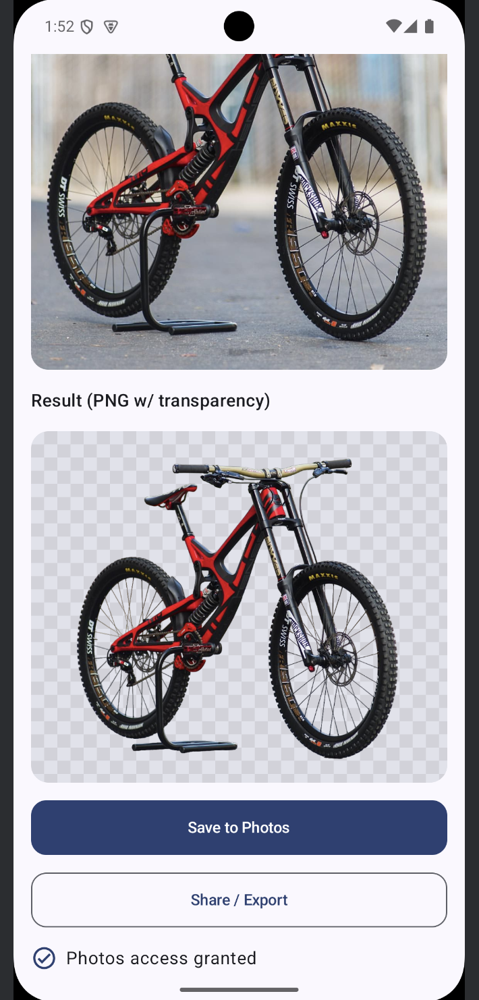

# BEN Background Removal Android (Kotlin + Compose) Demo

Pick an image, upload it to the Background Erase API, and save the returned cutout to Downloads. The app previews the PNG with transparency, lets you save to Photos, and share/export it.

Screenshot:

## Project layout
- Kotlin/net/BENClient.kt — lightweight API client (OkHttp + coroutines) and MediaStore save
- Kotlin/MainActivity.kt — Jetpack Compose UI, pickers, calls BENClient
- Kotlin/build.gradle.kts — app module build file
- Kotlin/app_demo.png — UI screenshot

## Requirements
- Android Studio (latest)
- JDK 11
- Android minSdk 24, target/compileSdk 36
- A Background Erase API key (x-api-key for https://api.backgrounderase.net/v2)

## Generate api token 
You must have a business subscription that can be found at https://backgrounderase.net/pricing. To generate the token navigate to
https://backgrounderase.net/account and scroll to the bottom of the page.

## Quick start

1) Open the project in Android Studio.

2) Add your API key.
- Easiest: replace the placeholder in MainActivity.kt:
  private val apiKey = "YOUR_API_KEY_HERE"

- Recommended: keep secrets out of source. Add to local.properties:
  BEN_API_KEY=your_real_key_here
  Then in app/build.gradle.kts:
  android {
      defaultConfig {
          buildConfigField("String", "BEN_API_KEY", "\"${project.findProperty("BEN_API_KEY") ?: ""}\"")
      }
  }
  And use BuildConfig.BEN_API_KEY in MainActivity:
  private val apiKey = BuildConfig.BEN_API_KEY

3) Ensure INTERNET permission is declared (AndroidManifest.xml):
<uses-permission android:name="android.permission.INTERNET"/>

Note: On Android 10+ (API 29+), saving to Downloads/Photos via MediaStore needs no storage permission. On Android 9 and below (API 28-), writing to external storage may require WRITE_EXTERNAL_STORAGE and a runtime permission request if you intend to support those devices.

4) Build and run on a device/emulator. Pick an image (Files or Photos), tap “Remove Background,” then view/save/share the result.

## Dependencies (already included)
- OkHttp 4.12.0
- Kotlin Coroutines (Android) 1.9.0
- Coil Compose 2.6.0
- Jetpack Compose Material 3 + Activity/Runtime/UI libs

See Kotlin/build.gradle.kts for the full list.

## How it works
- BENClient.removeBackgroundAndSaveToDownloads streams the picked image as multipart/form-data (form field: image_file) to https://api.backgrounderase.net/v2 with the x-api-key header.
- On success, it inspects the response Content-Type (png or jpg) and writes the returned bytes to Downloads via MediaStore, returning the saved Uri.
- MainActivity:
  - Lets the user pick an image via system pickers (no storage permission required).
  - Calls BENClient on a background thread.
  - Displays the result over a checkerboard to show transparency (Coil).
  - Provides “Save to Photos” and “Share / Export.”

## Using BENClient in your code
suspend fun uploadAndSave(context: Context, uri: Uri, apiKey: String): Uri {
    return BENClient.removeBackgroundAndSaveToDownloads(
        context = context,
        inputUri = uri,
        apiKey = apiKey
    )
}

Notes:
- Multipart field name is image_file.
- The client streams data; no need to load the whole image into memory.
- Timeouts: connect 30s, read/write 120s (tweak in BENClient.http if needed).

## Permissions
- Required: INTERNET
- Optional (only for API 28 and below if you need to write to external storage directly): WRITE_EXTERNAL_STORAGE and runtime request. For API 29+, MediaStore scoped storage is used and no legacy permissions are required.

## Troubleshooting
- HTTP 401 Unauthorized: Check x-api-key value and that it’s being sent. If using BuildConfig, verify local.properties and Gradle sync.
- HTTP 413 Payload Too Large: Try smaller images or compress; confirm server limits.
- Save failed: On API 28-, ensure WRITE_EXTERNAL_STORAGE is granted before writing to Downloads. Also confirm there’s free space.
- UnknownHostException / SSL issues: Verify network connectivity; emulator might need to use a network profile with Internet.
- Blank/black preview: Check the saved Uri and that the file has non-zero length. Coil logs in Logcat can help.

## Production tips
- Don’t ship your API key in plaintext. Options:
  - Store in server and proxy requests from your app.
  - Use encrypted storage or secure remote config guarded by your own auth.
- Add retry/backoff around network calls if desired.
- Handle rate limiting and present user-friendly errors.
- Consider uploading smaller images to reduce latency and data usage.

## ProGuard / R8
- OkHttp, Coroutines, and Coil generally work out-of-the-box with default Android rules. If you add your own model classes or reflection-heavy code, add keep rules accordingly.

## License
This sample is provided as-is for integration guidance. Adapt to your app’s requirements.