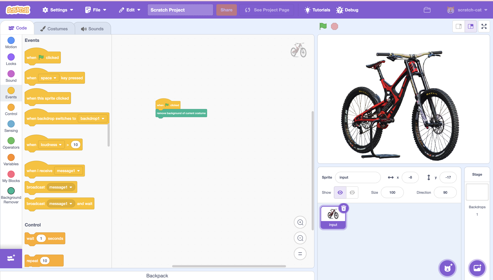

# Scratch Background Remover (BEN API) — Extension + Local Proxy

Remove the background of the current costume in Scratch with one block. This project contains:
- A Scratch 3.0 extension that uploads the current costume (PNG/JPG bitmap) to a local proxy
- A Node.js proxy that forwards the image to BackgroundErase.NET and returns a PNG with transparency
- The extension then creates a new costume "(bg)" with the cutout and selects it

Folders and files:
- extensions/ben-bg/index.js — Scratch extension (CommonJS)
- proxy/server.js — Local proxy (Express + Multer + CORS)

API docs: https://api.backgrounderase.net/v2  
Get your API key: https://backgrounderase.net/account  
Pricing: https://backgrounderase.net/pricing

Note: SVG costumes are not supported. Use Scratch’s “Convert to Bitmap” first.

--------------------------------------------------------------------------------

Quick start

1) Prerequisites
- Node.js 18+ (for built-in fetch/FormData/Blob)
- NPM or Yarn
- A BackgroundErase.NET API key (BEN_API_KEY)
- Scratch 3 development setup (scratch-gui + scratch-vm) or any Scratch fork where you can add a custom VM extension

2) Set up and run the local proxy
- Open a terminal in proxy/
- Install dependencies and run:
  npm install express multer cors
  # macOS/Linux
  export BEN_API_KEY=YOUR_API_KEY
  node server.js

  # Windows (PowerShell)
  setx BEN_API_KEY "YOUR_API_KEY"
  # restart the shell so the env var is picked up, then:
  node server.js

- The proxy starts on http://localhost:3001
- Endpoints:
  - POST /erase (multipart form-data, field name: image_file)
  - GET  /ping (health check; returns {"ok": true})

3) Wire the extension into Scratch
- Copy extensions/ben-bg to your scratch-vm repo under src/extensions/ben-bg
  For example:
  scratch-vm/
    src/
      extensions/
        ben-bg/
          index.js

- Register the extension in scratch-vm so it can be loaded. In most VM versions there’s a built-in extension map. Add an entry for benbg. In newer scratch-vm this is typically in src/extension-support/builtin-extensions.js (or nearby). Add something like:
  const BenBg = require('../extensions/ben-bg/index.js');
  module.exports = {
    // ... existing entries ...
    benbg: BenBg
  };

  If your version uses functions:
  module.exports = {
    // ... existing entries ...
    benbg: () => require('../extensions/ben-bg/index.js')
  };

- Expose the extension in scratch-gui’s library (so it shows as a tile):
  In scratch-gui, edit src/lib/libraries/extensions/index.jsx and add an entry:
  {
    name: 'Background Remover',
    extensionId: 'benbg',
    collaborator: 'BackgroundErase.NET',
    iconURL: null, // you can add a local icon if you have one
    insetIconURL: null,
    description: 'Remove the background of the current costume',
    featured: true
  }

- Link scratch-vm into scratch-gui if you aren’t already:
  In scratch-vm:
    npm install
    npm link
  In scratch-gui:
    npm install
    npm link scratch-vm
    npm start

- By default scratch-gui dev runs on http://localhost:8601, which matches the proxy’s CORS allowlist. If you run on a different host/port, update the CORS origin regex in proxy/server.js.

4) Use it in Scratch
- Start your proxy (node proxy/server.js)
- Start scratch-gui (npm start), open http://localhost:8601
- Add the “Background Remover” extension
- In a sprite with a bitmap costume:
  - Select the costume you want
  - Run the block: “remove background of current costume”
  - A new costume named “<original> (bg)” will be appended and selected

--------------------------------------------------------------------------------

How it works

- The extension tries multiple ways to read the current costume’s bytes (inline asset, storage cache, storage.load)
- It sends the bitmap bytes to the proxy as multipart form-data with field image_file
- The proxy forwards the image to https://api.backgrounderase.net/v2 with your BEN_API_KEY
- The API returns a PNG (with transparency)
- The extension:
  - Registers the PNG with Scratch storage to get an assetId
  - Creates an ImageBitmap and a skin
  - Appends and selects a new costume named “(bg)”
- Original costumes are never mutated; you get a new costume instead

--------------------------------------------------------------------------------

Configuration

- API key
  - Set BEN_API_KEY in your shell before starting the proxy
  - Keep your API key secret. Never hardcode it in the extension or send it to the browser

- Proxy URL
  - The extension defaults to http://localhost:3001/erase
  - To use a deployed proxy, change this.proxyURL in extensions/ben-bg/index.js
    Example: this.proxyURL = 'https://your-domain.example.com/erase';

- CORS
  - proxy/server.js allows origins:
    - http://localhost:8601
    - http://127.0.0.1:8601
  - If you host Scratch elsewhere (different port/host), update:
    app.use(cors({
      origin: [/^http:\/\/localhost:8601$/, /^http:\/\/127\.0\.0\.1:8601$/],
      ...
    }));

- Timeouts
  - Extension timeouts:
    - storage.load: 4s
    - proxy fetch: 15s
  - Adjust in extensions/ben-bg/index.js if needed

- Saved images
  - The proxy saves a copy of each returned PNG under proxy/saved for debugging/auditing
  - Modify or remove that section if you don’t want local copies

--------------------------------------------------------------------------------

Testing the proxy without Scratch

- Health check:
  curl http://localhost:3001/ping

- Background removal with curl:
  curl -F "image_file=@/path/to/input.jpg" http://localhost:3001/erase --output out.png

You should get a PNG with transparency in out.png.

--------------------------------------------------------------------------------

Troubleshooting

- Error: “SVG costume; please Convert to Bitmap first.”
  - Use Scratch’s “Convert to Bitmap” button in the costume editor

- Error: “Background Remover: could not read costume bytes”
  - Check devtools console for logs; ensure the costume is bitmap and available
  - Try switching costumes or re-uploading the image

- Error: “Background Remover: network error”
  - Ensure the proxy is running on http://localhost:3001
  - Check that your browser can reach http://localhost:3001/ping
  - Verify CORS origins in proxy/server.js match your Scratch GUI URL

- Error: “API returned an error”
  - Confirm BEN_API_KEY is set and valid
  - Check your plan/limits: https://backgrounderase.net/pricing
  - Inspect server logs for the upstream API response

- Nothing happens after clicking the block
  - Open browser devtools console; the extension logs detailed steps under [benbg]
  - Verify the extension is properly registered in scratch-vm and exposed in scratch-gui

--------------------------------------------------------------------------------

Security and privacy

- Your BEN_API_KEY must live on the server (proxy), never in client code
- Images are transmitted to BackgroundErase.NET for processing
- The proxy saves images to disk by default (proxy/saved). Remove this if not desired

--------------------------------------------------------------------------------

Project structure

- extensions/ben-bg/index.js
  - CommonJS Scratch 3 extension class BenBackgroundRemover
  - Adds a single command block: “remove background of current costume”
  - Talks to the proxy via POST to this.proxyURL

- proxy/server.js
  - Express + Multer + CORS
  - POST /erase accepts multipart form-data field image_file
  - Forwards to https://api.backgrounderase.net/v2 with x-api-key header
  - Returns raw PNG bytes; also saves a local copy to ./saved

--------------------------------------------------------------------------------

Package.json example for the proxy (optional)

{
  "name": "ben-proxy",
  "private": true,
  "type": "module",
  "engines": {
    "node": ">=18"
  },
  "dependencies": {
    "cors": "^2.8.5",
    "express": "^4.19.2",
    "multer": "^1.4.5-lts.1"
  },
  "scripts": {
    "start": "node server.js"
  }
}

Usage:
- cd proxy
- npm install
- BEN_API_KEY=YOUR_API_KEY npm start

--------------------------------------------------------------------------------

Notes for alternative setups

- TurboWarp or custom Scratch builds
  - This extension uses Scratch 3’s class-based extension API with CommonJS require calls, designed for scratch-vm
  - TurboWarp supports custom extensions but prefers ESM and its own packaging. You may need to adapt imports and packaging for TW’s extension loader
  - If you run Scratch on a different origin/port, update proxy CORS and extension’s this.proxyURL

- Deploying the proxy
  - Any Node host will do (Render, Fly, Railway, a VPS)
  - Ensure:
    - BEN_API_KEY is set in server env
    - CORS allows your Scratch origin
    - Update this.proxyURL in the extension to your public URL

--------------------------------------------------------------------------------

License

- Add your license of choice for this repository (e.g., MIT). If you include third-party assets/icons, ensure you have rights to use them.

--------------------------------------------------------------------------------

Credits

- Background removal by BackgroundErase.NET
- Built for Scratch 3.0 extension API and Node.js 18+ proxy setup

Issues and contributions welcome. When filing an issue, include:
- Your OS/browser versions
- Node.js version
- Scratch VM/GUI commit/branch you’re using
- Exact logs from browser console and proxy server console