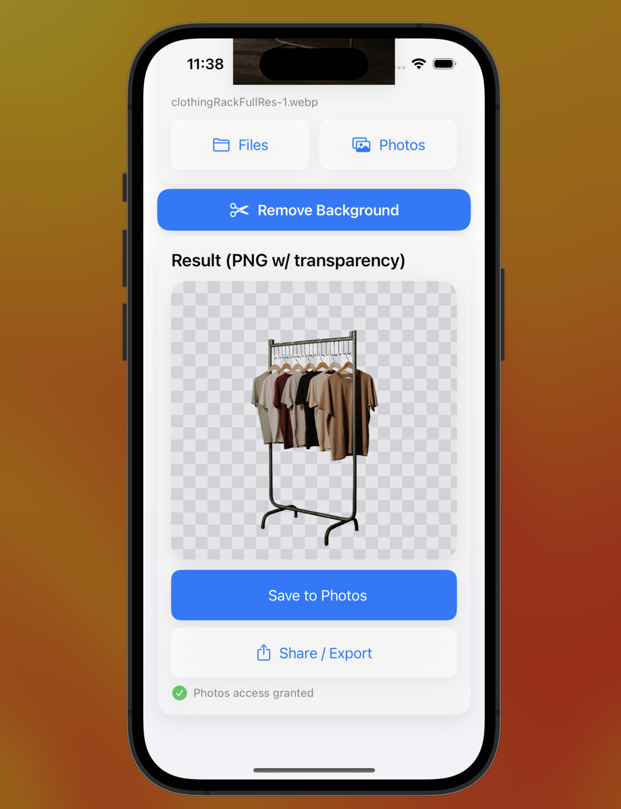

# BEN2 Swift API Client + iOS Demo

A minimal Swift client for BackgroundErase.NET with a polished iOS demo app. Pick a photo, remove the background via the API, and save/share the result (PNG with transparency).

- API: https://api.backgrounderase.net/v2
- Get your API key: https://backgrounderase.net/account
- Buy/upgrade a plan: https://backgrounderase.net/pricing



## Quick start

1) Get an API key  
- Create an account or sign in: https://backgrounderase.net/account  
- If needed, purchase a plan: https://backgrounderase.net/pricing

2) Add your API key to Info.plist  
- Key: BEN2_API_KEY  
- Value: your API key string

3) Build and run the demo  
- Open the Xcode project/workspace in the Swift folder  
- Run on iOS 16+ simulator or device  
- Pick an image, tap “Remove Background,” then Save or Share

## Requirements

- Xcode 14+  
- iOS 16+ (PhotosPicker and NavigationStack require iOS 16)  
- Swift 5.7+ (async/await)

## Install

Option A: Clone this repo
```shell
git clone --no-checkout https://github.com/PramaLLC/Swift.git
cd Swift
git sparse-checkout init --cone
git sparse-checkout set Swift
git checkout main
```
- Open the Xcode project/workspace in the Swift folder


Option B: Copy into your project
- Copy Swift/BENClient.swift into your app target
- (Optional) Copy demo UI files if you want the same UX

## Configuration

API key
- The client reads BEN2_API_KEY from your app’s Info.plist by default:
  - BEN2Client.shared = BEN2Client(apiKey: Bundle.main["BEN2_API_KEY"] ?? "YOUR_API_KEY")
- You can also pass the key manually:
  - let client = BEN2Client(apiKey: "YOUR_API_KEY")

Base URL
- Defaults to https://api.backgrounderase.net/v2; no change needed for normal use

Timeouts/retries
- removeBackground(...) accepts a timeout parameter (default 60s)

## iOS Photo Library permissions (to save results)

Add these to your app’s Info.plist:

- NSPhotoLibraryAddUsageDescription (String)  
  We save your cutouts to your Photos library.

- NSPhotoLibraryUsageDescription (String, recommended)  
  We need access to your photos to pick an image.

XML example:
```xml
<key>BEN2_API_KEY</key>
<string>YOUR_API_KEY</string>
<key>NSPhotoLibraryAddUsageDescription</key>
string>We save your cutouts to your Photos library.</string>
<key>NSPhotoLibraryUsageDescription</key>
<string>We need access to your photos to pick an image.</string>
```

After changing Info.plist
- Product → Clean Build Folder (⌘⇧K)
- Delete the app from simulator/device
- Run again (⌘R)

## Using the API client

The API returns raw PNG bytes (with transparency). The client handles multipart upload for a single image under field name image_file.

Simple usage with a UIImage:
```swift
import UIKit

let client = BEN2Client.shared // uses BEN2_API_KEY from Info.plist

let pngBytes = try await client.removeBackground(
    image: myUIImage,
    filename: "image.jpg",   // extension informs MIME type detection
    jpegQuality: 0.9,
    timeout: 60
)

let cutout = UIImage(data: pngBytes) // PNG with transparency
```

Uploading arbitrary Data:
```swift
let data: Data = ... // image bytes (jpg/png/heic/webp)
let pngBytes = try await client.removeBackground(
    imageData: data,
    filename: "photo.png",
    timeout: 60
)
```

Supported input extensions for MIME detection:
- jpg, jpeg, png, heic, webp (others fallback to application/octet-stream)

## Demo app notes

- Pick an image from Files or Photos
- Tap “Remove Background”
- Save to Photos (with add-only permission on iOS 14+) or Share/Export
- Result section shows a checkerboard under the PNG to preview transparency

The demo includes permission-aware saving via Photos framework. If you prefer the simplest possible save, you can use UIImageWriteToSavedPhotosAlbum, but add-only access is recommended for iOS 14+.


Issues and pull requests are welcome. Please include:
- Xcode version
- iOS version/device
- Reproduction steps and logs

